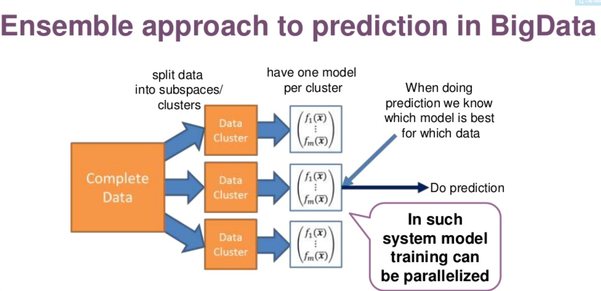

# Ensemble models in PySpark

The picture was obtained from [here](https://www.slideshare.net/jozefhabdank/prediction-as-a-service-with-ensemble-model-in-sparkml-and-python-scikitlearn).
# Ensemble models - PySpark

## Goal
To examplify the uses of ensemble models in PySpark as the ensemble models in [previous project using sklearn and keras](https://github.com/tankwin08/ensemble-models-ML-DL-) and predict if the client will subscribe (yes/no) a term deposit (variable y) using market campaign data.

## Ensemble models

Ensemble modeling is a process where multiple diverse models are created to predict an outcome, either by using many different modeling algorithms or using different training data sets. The ensemble model then aggregates the prediction of each base model and results in once final prediction for the unseen data. The motivation for using ensemble models is to reduce the generalization error of the prediction. As long as the base models are diverse and independent, the prediction error of the model decreases when the ensemble approach is used.

The approach seeks the wisdom of crowds in making a prediction. Even though the ensemble model has multiple base models within the model, it acts and performs as a single model.

A signle model generally suffers from high bias or high variance due to data quality, train and test data drift, distribution of hypothesis...

The goal of the modelling to find a method wit low bias and low variance. Thus, it is common to **aggregate** several base models to provide solutions.

### Aggregate strategies

There are multiple ways to conduct aggregation and improve the model performance either from accuracy or robustness. 

**1 Baggging**

The bagging strategy is built on the bootstrap sampling. In short, it built multiple classifer independently and in parallel using data derived from resampling from the training set. Then aggregate these classifiers using average processing or major vote to redce the variability of prediction. However the accuracy/point estimate is not improved.

**2 Boosting**

 
The boosting is similar to bagging strategy to some extent in terms of resampling methods. But it differs in two major ways:

    1 how trees are built: The Bagging method builds each tree independently while Boosting method builds one tree at a time. This additive model (ensemble) works in a forward stage-wise manner, introducing a weak learner to improve the shortcomings of existing weak learners. 
    
    2 Results combination: The Bagging method combine results at the end of the process (by averaging or "majority rules") while the boosting combines results along the way.
    
If you carefully tune parameters, boosting can result in better performance than bagging. However, boosting may not be a good choice if you have a lot of noise, as it can result in overfitting. They also tend to be harder to tune than bagging method.

**3 Stacking**

Stacking provide a whole new different way to combine classifers. There are two major differences:

    1 stacking often considers heterogeneous weak learners (different learning algorithms are combined) whereas bagging and boosting consider mainly homogeneous weak learners.
    
    2 The stacking uses a second layer model which uses the predictions of weak classifiers such as bagging and bostting results as input.

In this project, the stacking strategy was used to predict if the client will subscribe (yes/no) a term deposit (variable y) using market campaign data.

## Data

The data used for this project can be downloaded from [here](https://archive.ics.uci.edu/ml/machine-learning-databases/00222/).

The explination of the data can be found [here](https://archive.ics.uci.edu/ml/datasets/bank+marketing).

The data is related with **direct marketing campaigns of a Portuguese banking institution**. The marketing campaigns were based on phone calls. Often, more than one contact to the same client was required, in order to access if the product (bank term deposit) would be ('yes') or not ('no') subscribed. 

### Input variables:

**bank client data:**

    1 - age (numeric)
    2 - job : type of job (categorical: 'admin.','blue-collar','entrepreneur','housemaid','management','retired','self-employed','services','student','technician','unemployed','unknown')
    3 - marital : marital status (categorical: 'divorced','married','single','unknown'; note: 'divorced' means divorced or widowed)
    4 - education (categorical: 'basic.4y','basic.6y','basic.9y','high.school','illiterate','professional.course','university.degree','unknown')
    5 - default: has credit in default? (categorical: 'no','yes','unknown')
    6 - housing: has housing loan? (categorical: 'no','yes','unknown')
    7 - loan: has personal loan? (categorical: 'no','yes','unknown')
    
**related with the last contact of the current campaign:**

    8 - contact: contact communication type (categorical: 'cellular','telephone') 
    9 - month: last contact month of year (categorical: 'jan', 'feb', 'mar', ..., 'nov', 'dec')
    10 - day_of_week: last contact day of the week (categorical: 'mon','tue','wed','thu','fri')
    11 - duration: last contact duration, in seconds (numeric). 
    
**Important note:** Attribute 11 highly affects the output target (e.g., if duration=0 then y='no'). Yet, the duration is not known before a call is performed. Also, after the end of the call y is obviously known. Thus, this input should only be included for benchmark purposes and should be discarded if the intention is to have a realistic predictive model.

**other attributes:**

    12 - campaign: number of contacts performed during this campaign and for this client (numeric, includes last contact)
    13 - pdays: number of days that passed by after the client was last contacted from a previous campaign (numeric; 999 means client was not previously contacted)
    14 - previous: number of contacts performed before this campaign and for this client (numeric)
    15 - poutcome: outcome of the previous marketing campaign (categorical: 'failure','nonexistent','success')

**social and economic context attributes**

    16 - emp.var.rate: employment variation rate - quarterly indicator (numeric)
    17 - cons.price.idx: consumer price index - monthly indicator (numeric) 
    18 - cons.conf.idx: consumer confidence index - monthly indicator (numeric) 
    19 - euribor3m: euribor 3 month rate - daily indicator (numeric)
    20 - nr.employed: number of employees - quarterly indicator (numeric)

**Output variable (desired target):**

    21 - y - has the client subscribed a term deposit? (binary: 'yes','no')
    
    
    
    
## References

[Machine Learning Case Study with Spark: Make it better](http://people.stat.sc.edu/haigang/improvement.html).

